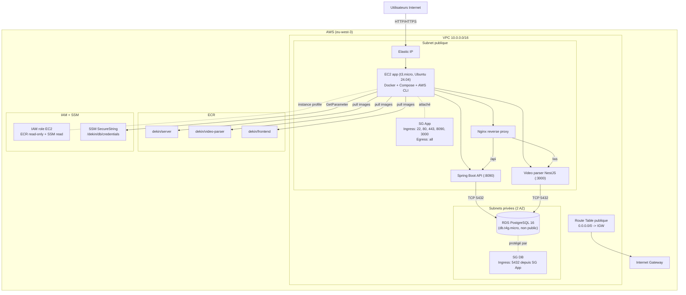

```mermaid
flowchart TB
    user["Utilisateurs Internet"]

    subgraph AWS["AWS (eu-west-3)"]
        igw["Internet Gateway"]

        subgraph VPC["VPC 10.0.0.0/16"]
            rt["Route Table publique\n0.0.0.0/0 -> IGW"]

            subgraph PUB["Subnet publique"]
                eip["Elastic IP"]
                ec2["EC2 app (t3.micro, Ubuntu 24.04)\nDocker + Compose + AWS CLI"]
                sgapp["SG App\nIngress: 22, 80, 443, 8090, 3000\nEgress: all"]

                nginx["Nginx reverse proxy"]
                api["Spring Boot API (:8090)"]
                parser["Video parser NestJS (:3000)"]

                ec2 --> nginx
                ec2 --> api
                ec2 --> parser
            end

            subgraph PRIV["Subnets privées (2 AZ)"]
                dbsg["SG DB\nIngress: 5432 depuis SG App"]
                rds[("RDS PostgreSQL 16\n(db.t4g.micro, non public)")]
            end
        end

        subgraph REG["ECR"]
            ecr1["dekin/server"]
            ecr2["dekin/video-parser"]
            ecr3["dekin/frontend"]
        end

        subgraph SEC["IAM + SSM"]
            role["IAM role EC2\nECR read-only + SSM read"]
            ssm["SSM SecureString\n/dekin/db/credentials"]
        end
    end

    user -->|"HTTP/HTTPS"| eip
    eip --> ec2
    rt --> igw

    ec2 -. "attaché" .- sgapp
    rds -. "protégé par" .- dbsg

    nginx -->|"/api"| api
    nginx -->|"/ws"| parser

    api -->|"TCP 5432"| rds
    parser -->|"TCP 5432"| rds

    ec2 -->|"pull images"| ecr1
    ec2 -->|"pull images"| ecr2
    ec2 -->|"pull images"| ecr3

    ec2 -->|"GetParameter"| ssm
    ec2 -. "instance profile" .- role
```
